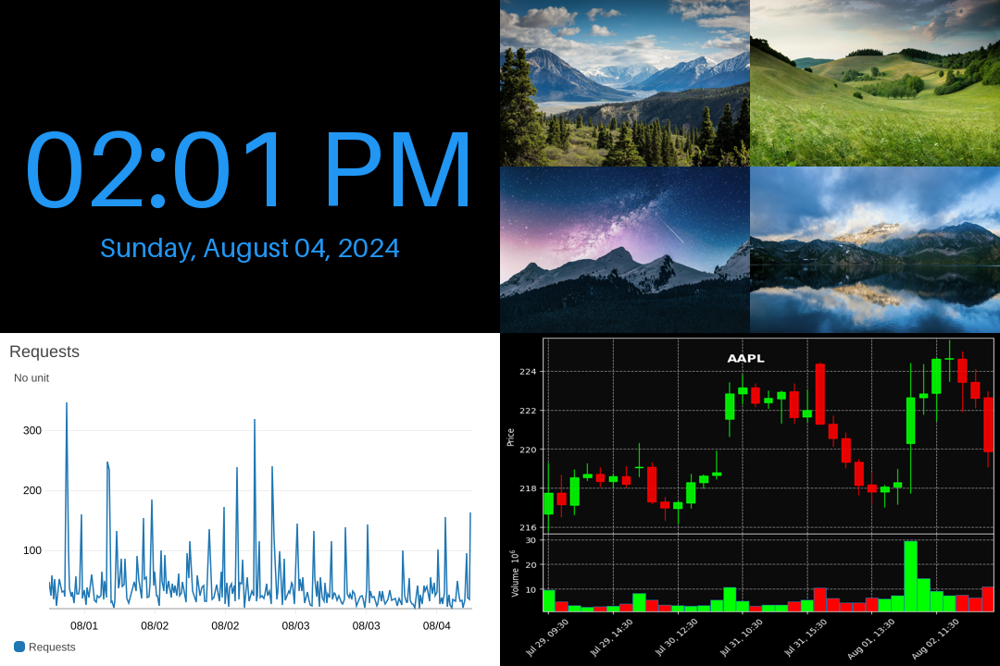
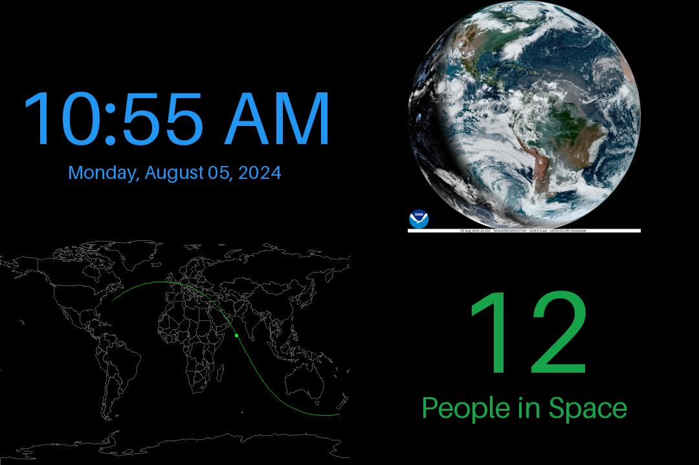

# fb-dashboard

## Usage

Copy `examples/example1.toml` -> `config.toml` and edit to your desired configuration.

```bash
# install requirements
pip3 install -r requirements.txt

# set graphics mode for the current screen's tty (usually tty1)
sudo python3 gfxmode.py /dev/tty1 graphics

# run the dashboard
python3 -m fb_dashboard
```

## Basic config with Cloudwatch Dashboards
Config file, may need to customize the widget to the one you want to display. the `widget` is also eval()'ed like the x, y, w, and h variables, so you can dynamically specify the width and height of the image.

```toml
[widgets.cloudwatch]
x = 0
y = 0
w = 'w'
h = 'h'
type = 'CloudWatchMetricImage'
widget = '{"metrics": [[ "AWS/CloudFront", "Requests", "Region", "Global", "DistributionId", "YOUR_DISTRIBUTION_ID_HERE" ]],"view": "timeSeries","stacked": false,"stat": "Sum","period": 900, "width": w, "height": h,"start": "-PT72H", "end": "P0D", "timezone": "-0400"}'
```

## Examples
[](examples/example1.toml)
[](examples/example2.toml)

## Config Options By Type
For usage examples, see the `examples/` folder for some starter templates.

- all:
  - `x` - x position on screen
  - `y` - y position on screen
  - `w` - width of the widget
  - `h` - height of the widget
  - `refresh_interval` - minimum time (in seconds), between widget refreshes
- `CloudWatchMetricImage`
  - `widget` - a JSON string from CloudWatch's metric image export function
  - `aws_profile` - (optional) AWS profile name
  - `aws_region` - (optional) AWS region name
  - `invert_image` - (optional) invert metric image, to obtain dark mode
- `Image`
  - `path` - local path, http://, or https:// link to the image
  - `auth_type` - (optional) `basic` (default), or `digest`. Only used if username and password are set.
  - `username` - (optional) auth username
  - `password` - (optional) auth password
  - `invert_image` - (optional) invert image
- `Clock`
  - `clock_format` - (optional) clock format string, e.g. `%H:%M:%S` or `%I:%M %p`
  - `date_format` - (optional) date format string, e.g. `%Y-%m-%d` or `%A, %B %d, %Y`
  - `timezone` - (optional) e.g. America/New_York
  - `bg_color` - bg color, in hex or `rgb()` format.
  - `fg_color` - bg color, in hex or `rgb()` format.
- `StockMarketCandlestick` - stock market data from Yahoo finance
  - `symbol` - required, the symbol. e.g. `AAPL`.
  - `plot_style` - (optional) [a mplfinance theme name](https://github.com/matplotlib/mplfinance/blob/master/examples/styles.ipynb), default nightclouds
  - `up_color` - (optional) up candlestick color, default `#00FF00`
  - `down_color` - (optional) down candlestick color, default `#FF0000`
  - `time_period` - (optional) time period to show. default `1mo`
    - allowed values: '1d', '5d', '1mo', '3mo', '6mo', '1y', '2y', '5y', '10y', 'ytd', 'max'
  - `interval` = (optional) time interval for each candlestick. default:  `1d`
    - allowed values: 1m, 2m, 5m, 15m, 30m, 60m, 90m, 1h, 1d, 5d, 1wk, 1mo, 3mo
- `SatelliteMap` - satellite tracks via Celestrak
  - `bg_color` - (optional) rgb/hex color, default `#000000`
  - `map_color` - (optional) rgb/hex color for map outline, default `#999999`
  - `track_color` - (optional) rgb/hex color for tracks, default `#00bf00`
  - `satellite_color` - (optional) rgb/hex color for satellite marker pins, default `#00ff00`
  - `pin_radius` - (optional) integer size of pins. Is eval expression, can use `w` / `h` vars for computed widget size
- `Metric` - a large metric that can pull from JSON APIs, and has a configurable subtitle label
  - `url` - the url to load from.
  - `bg_color` - bg color, in hex or `rgb()` format.
  - `fg_color` - bg color, in hex or `rgb()` format.
  - `label` - subtitle label
  - `mode` - supported: `json`
  - `json_path` - required - a dot notation keypath within the JSON loaded from to locate the number to display

- `Text` (experimental)
  - `text` - text to display
  - `size` - font size
  - `bg_color` - bg color, in hex or `rgb()` format.
  - `fg_color` - bg color, in hex or `rgb()` format.

## Run at boot

On raspberry pi, `/etc/rc.local` is a pretty easy place to run scripts at boot. Add this line before `exit 0`:

You will likely need to change the username, path to the cloned repo, and any virtual env you might be using. This will run the graphics mode script as root, then run the main script as the normal user.

```bash
python3 /home/rich/aws-dash/gfxmode.py /dev/tty1 1

# if using a virtualenv
sudo -u rich bash -c 'cd /home/rich/fb-dashboard && source env/bin/activate && python3 -m fb_dashboard'
```

If not using a virtual environment you replace the last line above with this:
```bash
# if not using a virtualenv
sudo -u rich bash -c 'python3 cd /home/rich/fb-dashboard && python3 -m fb_dashboard'
```

## Debugging on non-linux system
```
# writes to `framebuffer.png` in current dir
python3 -m fb_dashboard --no-framebuffer
```

## Security
This isn't designed to be used with untrusted data. The config file eval()'s several sections to allow for dynamic configuration. This is by design, so I do not recommend running this as root with untrusted images. Ensure you have the latest versions of the dependencies so they have the latest security patches.

## Development

This project uses [black](https://black.readthedocs.io/en/stable/the_black_code_style/current_style.html) for formatting.
